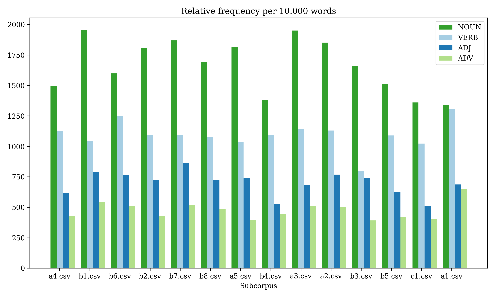

# Extracting linguistic features using spaCy
This repository holds the code for assignment 1 for language analytics (S2023). Linguistic features are extracted from each subcorpus of the USEcorpus. In addition to csv files, a plot is created for each subcorpus showing the relative frequency of nouns, verbs, adjectives and adverbs.

## Description of the data
The data used is the [Uppsala Student English Corpus](https://ota.bodleian.ox.ac.uk/repository/xmlui/handle/20.500.12024/2457). The corpus consists 1489 essays written by 440 Swedish university students of English at three different levels: first, second and third-term students. The corpus is divided into 14 subcorpora based on the students' levels and essay tasks.

## Usage and reproducibility
To extract the linguistic features of the USEcorpus run the following commands from the root of the directory.

1. Clone the repository
2. Create a virtual environment and install the requirements
```
bash setup.sh
```
3. Run the analysis and plot the relative frequency of nouns, verbs, adjectives and adverbs in each subcorpus
```
bash run.sh
```

The linguistic features of each of the subcorpora in the USEcorpus will be extracted and the results will be saved in the `out` directory.

## Repository structure
```
├── in                                
│   └── USEcorpus
├── out                                 
│   ├── a1.csv
│   ├── a2.csv
│   ├── ...
│   └── entities.png
├── src
│   ├── plot_entities.py
│   └── extract_ling_features.py            
├── assignment_description.md
├── requirements.txt       
├── run.sh
├── setup.sh      
└── README.md                           
```


## Results
For each subcorpus, a csv file is created. Each csv file contains the following information:

filename|relfreq_NOUN|relfreq_VERB|relfreq_ADJ|relfreq_ADV|unique_PERSON|unique_LOC|unique_ORG
|---|---|---|---|---|---|---|---|
|file1.txt|---|---|---|---|---|---|---|
|file2.txt|---|---|---|---|---|---|---|
|etc|---|---|---|---|---|---|---|


In the plot below the average relative frequency of nouns, verbs, adjectives and adverbs are plotted for each subcorpus.


The relative frequency of nouns are lowest in the `a1` subcorpus. However, this subcorpus has the highest relative frequency of verbs. This might be a result of the task of this essay. Students were asked to describe their experience with the English language, by evaluating their reading, writing, speaking, and listening proficiency in a personal involved style. This task might have resulted in a higher relative frequency of verbs.
